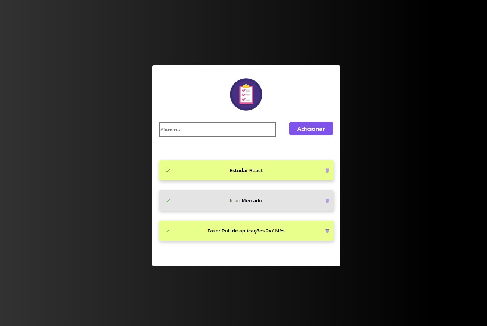

# Gerenciador de Tarefas

Um aplicativo web simples para gerenciar tarefas, permitindo criar, editar e excluir tarefas de maneira prática.

## 📌 Funcionalidades

- 📋 Criar, editar e excluir tarefas
- ✅ Marcar tarefas como concluídas

## 🛠️ Tecnologias Utilizadas

- React
- Vite
- Styled Components

## 🚀 Como Executar o Projeto

### Pré-requisitos

Antes de começar, você precisará ter instalado:

- [Node.js](https://nodejs.org/)
- Gerenciador de pacotes (npm ou yarn)

### Passos

1. Clone este repositório:
   ```bash
   git clone https://github.com/seu-usuario/gerenciador-de-tarefas.git
   ```
2. Acesse o diretório do projeto:
   ```bash
   cd gerenciador-de-tarefas
   ```
3. Instale as dependências:
   ```bash
   npm install
   ```
4. Inicie o servidor de desenvolvimento:
   ```bash
   npm run dev
   ```
5. Acesse o aplicativo no navegador:
   ```
   http://localhost:5173
   ```

## 📸 Captura de Tela

Abaixo está uma prévia do aplicativo em funcionamento:



## 📝 Contribuindo

Contribuições são bem-vindas! Siga estes passos:

1. Faça um fork do repositório
2. Crie uma nova branch: `git checkout -b minha-feature`
3. Faça as alterações e commit: `git commit -m 'Adiciona nova funcionalidade'`
4. Envie as alterações: `git push origin minha-feature`
5. Abra um Pull Request

## 📄 Licença

Este projeto está sob a licença MIT. Veja o arquivo [LICENSE](LICENSE) para mais detalhes.

---

Feito com ❤️ por [MarcusViniDev](https://github.com/arcusViniDev) 🚀


# React + Vite

This template provides a minimal setup to get React working in Vite with HMR and some ESLint rules.

Currently, two official plugins are available:

- [@vitejs/plugin-react](https://github.com/vitejs/vite-plugin-react/blob/main/packages/plugin-react/README.md) uses [Babel](https://babeljs.io/) for Fast Refresh
- [@vitejs/plugin-react-swc](https://github.com/vitejs/vite-plugin-react-swc) uses [SWC](https://swc.rs/) for Fast Refresh
